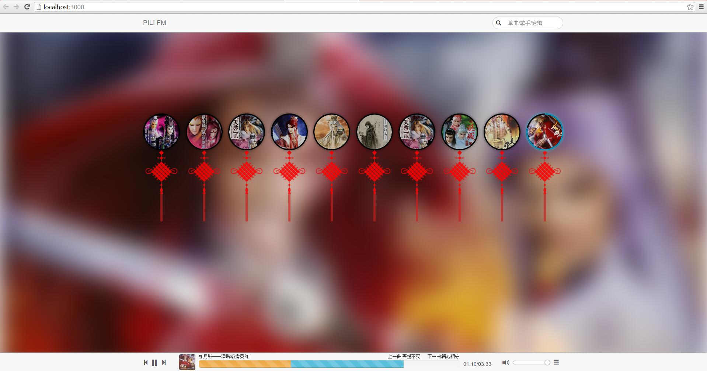

#PILI-MUSIC
###个人web音乐试听

##克隆项目到<code>c:</code>

<code>git clone https://www.github.com/huanghaiyang/pili-music.git</code>

##工程构建
###1.安装nodejs

将nodejs添加到环境变量Path中，方便使用npm命令安装软件包。

###2.安装bower

<code>npm install bower -g</code>

###3.在工程目录下安装必要的node_modules软件包

<code>npm install</code>

###4.使用bower在工程目录下安装必要的插件库

<code>bower install</code>

###5.确保安装了MongoDB
###6.启动MongoDB,指定数据文件位置

<code>mongod --dbpath c:\pili-music\data\</code>

如果提示data文件夹不存在，请先创建文件夹，可使用如下命令快速创建

<code>mkdir data</code>

###7.找到存放mp3音乐文件的目录，以<code>c:\CloudMusic</code>为例

<code>node bin/tool/af.js -d c:\CloudMuic</code>

af.js工具能够遍历文件夹<code>c:\CloudMusic</code>中的mp3音乐文件，并且对文件进行解析，提取海报图片、艺术家、唱片集等，写入到MongoDB数据库文件中。
###8.启动

<code>node bin/app -d c:\CloudMusic</code>

##效果截图

